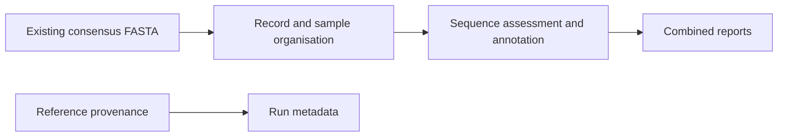

# Avian FASTA workflow overview

## Purpose and scope

The `AVIANFASTA` workflow analyses existing avian-influenza consensus sequences
in FASTA format. It organises sequence records by sample, produces sequence
quality and classification results, adds reference-based annotations, and
combines results into reports.

This page describes the modules and how to navigate the output. It does not
include analysis launch instructions, reference configuration, or mutation
interpretation procedures. Descriptions reflect the local
[workflow source](../workflows/avian-fasta.nf) and module metadata reviewed on
2026-09-15; they do not establish successful end-to-end execution.

## Workflow at a glance

This is a conceptual overview. Several modules run in separate branches, so
the diagram is not a task execution schedule.

A **module** is a named processing step. A **UID** is the internal identifier
used to associate records and results with a sample. A **consensus sequence**
represents an assembled sequence; this workflow does not generate consensus
sequences from raw sequencing reads.

## Modules

Names below match the process names in the source, including the existing
spelling of `SEGMENTIFENTIFIER`. Tables describe calls present in the workflow;
they do not imply that every sample produces a result from every module.

### Sample identity, formatting, and provenance

| Module | Short description |
| --- | --- |
| `EMIT_FASTA_RECORD` | Writes individual FASTA records with their assigned internal identifiers and filenames. |
| `WRITE_ID_MAP` | Writes `id_map.tsv`, linking internal sample identifiers to the original sample names derived from headers. |
| `REHEADER_TO_UID` | Standardises selected FASTA headers using the internal sample identifier. |
| `FASTA_CONFIGURATIONFASTA` | Prepares sequence-file formats used by the different analysis and reporting tools. |
| `REFERENCE_PROVENANCE` | Records SHA-256 checksums of staged reference files so their identity can be audited. |

### Sequence quality and classification

| Module | Short description |
| --- | --- |
| `SEGMENTIFENTIFIER` | Identifies influenza segments using sequence comparisons. |
| `SUBTYPEFINDER` | Produces influenza subtype assignments and supporting status tables. |
| `COVERAGE` | Assesses consensus-sequence completeness and produces quality-filtered sequence files. Its coverage measure is not raw-read sequencing depth. |
| `GENOTYPING` | Produces genotype assignments by comparison with reference data. |
| `NEXTCLADE` | Produces clade assignments and sequence-analysis summaries. |
| `REASSORTMENT` | Summarises evidence concerning differences in segment ancestry. |
| `GENIN2` | Produces an additional genotype assessment using GENIN2. |

### Biological annotations

These descriptions identify the purpose of each component without specifying
mutation targets, analysis settings, or interpretation criteria.

| Module | Short description |
| --- | --- |
| `AMINOACIDTRANSLATION` | Produces protein-sequence representations of consensus sequences. |
| `MUTATION` | Produces reference-comparison annotations for the avian reporting workflow. |
| `TABLELOOKUP` | Adds reference-table annotations concerning antiviral resistance. |
| `TABLELOOKUP_MAMMALIAN` | Adds reference-table annotations concerning mammalian adaptation. |
| `FLUMUT` | Produces influenza marker annotations and associated literature information. |

### Conversion and combined reporting

| Module | Short description |
| --- | --- |
| `FLUMUT_CONVERSION` | Converts FluMut output into the pipeline's reporting format. |
| `SLIM_GENIN2_REPORT` | Selects the GENIN2 columns used in the combined report. |
| `SURVEILLANCE_SUMMARY` | Combines quality, classification, and annotation evidence into structured surveillance summaries. |
| `REPORTAVIANFASTA` | Builds the combined avian FASTA CSV report, including sample identity and available results from the analysis branches. |

### Imported but inactive

| Module | Status |
| --- | --- |
| `MUTATIONHUMAN` | A human-influenza reference-comparison module. It is imported, but its call is commented out in this workflow. |

Raw-read processing modules such as FastQC, Chopper, and IRMA are not invoked
by this FASTA workflow. MultiQC is also not invoked here.

## Finding and reading results

Output directories are relative to the run's result directory:

| Location | What it contains |
| --- | --- |
| `reporthuman/` | The combined avian FASTA CSV report. The directory retains its historical name for wrapper compatibility. |
| `subtyping/`, `genotyping/`, `nextclade/`, `reassortment/` | Supporting classification results. |
| `flumut/`, `genin2/` | Tool-specific results and reporting conversions. |
| `surveillance/` | Structured surveillance summaries. |
| `pipeline_info/` | Execution metadata and the reference checksum manifest. |

Use sample identity and quality information to establish which records a report
describes. A missing result is not automatically a negative finding, and a
completed report does not by itself establish the validity of every biological
annotation. Consult the existing
[report data dictionary](report_data_dictionary.md) for column definitions and
missing-value conventions.

The [output reference](output.md) describes published files across all pipeline
modes; some entries there apply only to other workflows.

## Relationship to the wrapper

The external `avianseq_fasta_wrapper.sh` handles local setup, file transfers,
pipeline invocation, and result publication. Those activities are separate from
the Nextflow module inventory above.

The wrapper's selected remote revision can differ from this local checkout.
Validation mode still uploads report CSVs; it is not a dry run. The current
[wrapper review and operator notes](avian_fasta_wrapper_review.md) describe the
installed file safeguards, tested shell behavior, and unresolved issues.
